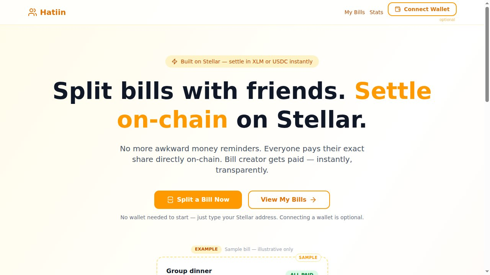
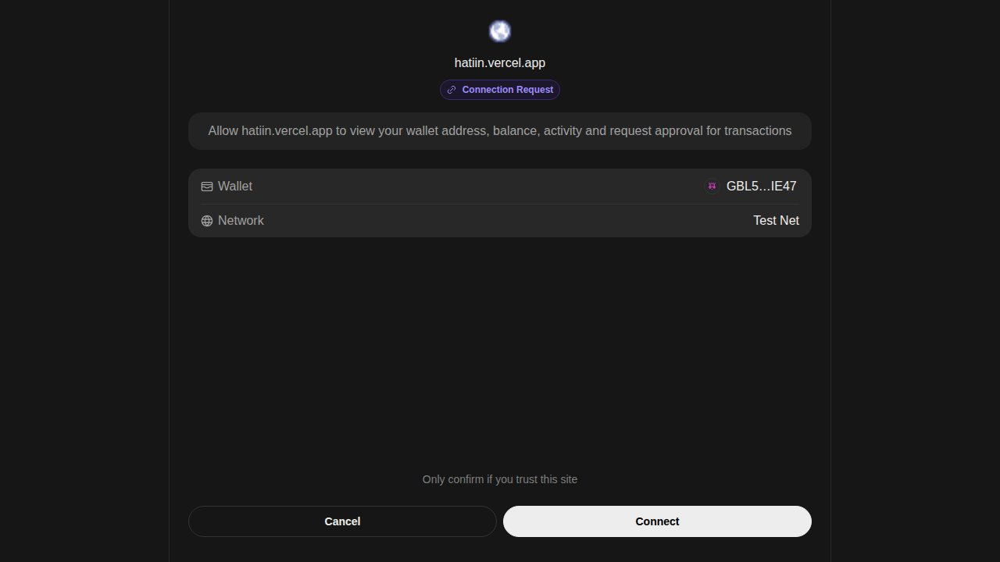
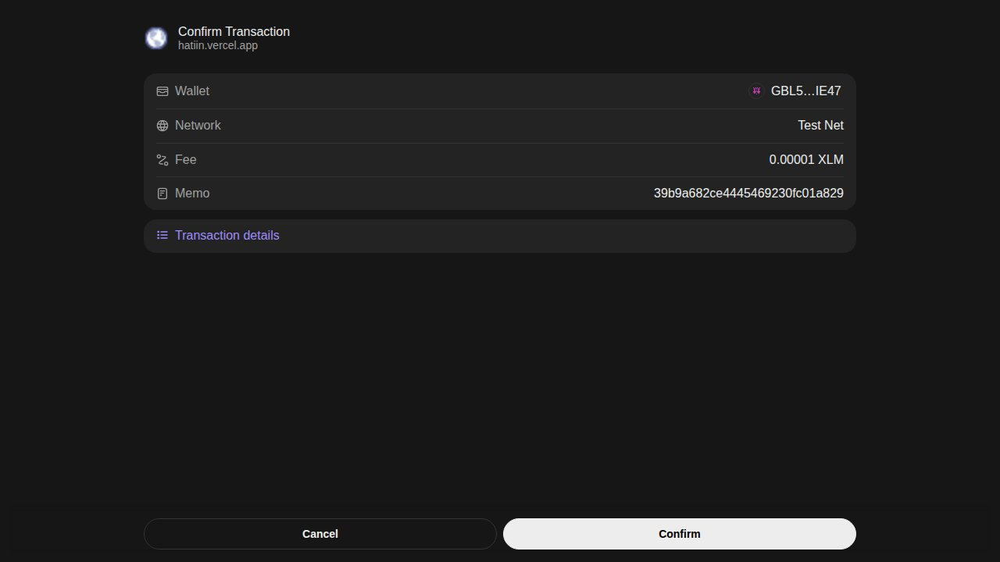
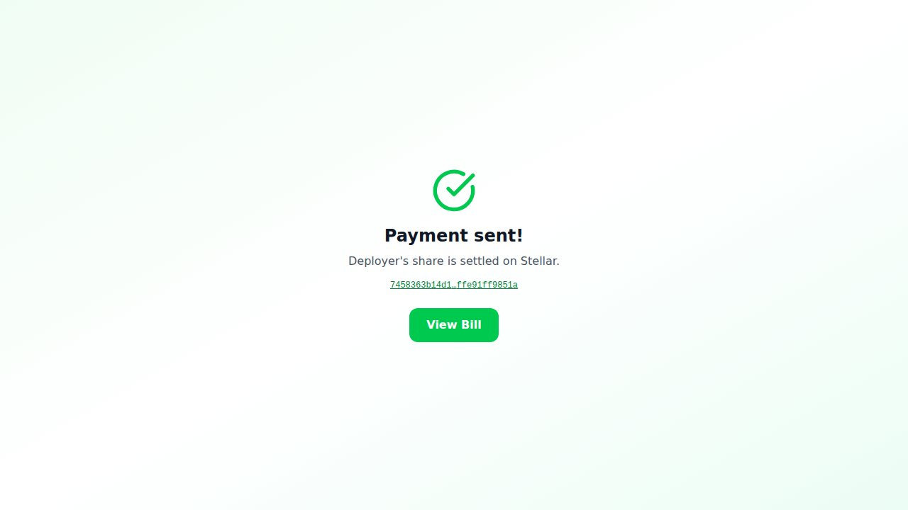
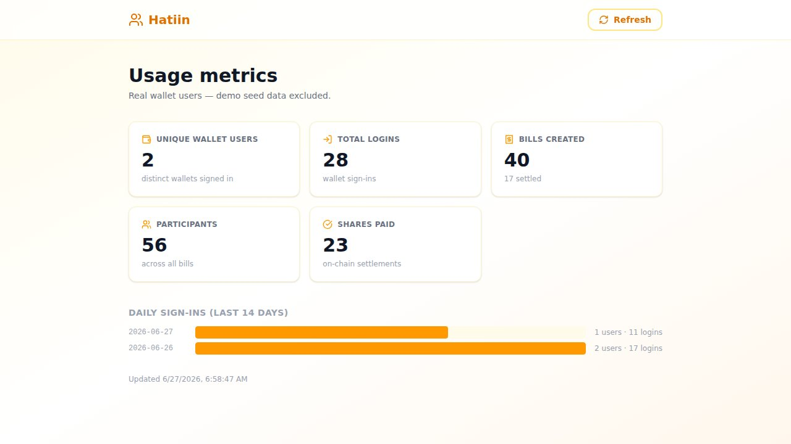
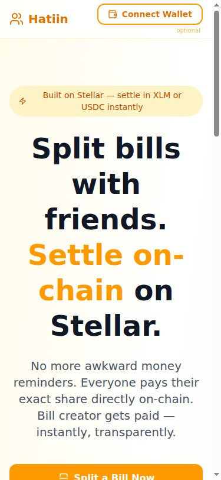

# Hatiin

## Submission Checklist

### Delivery

- [x] **Public GitHub repository** — link public repo
- [x] **Minimum 20+ meaningful commits** — see commit history on `main`
- [x] **Live deployed application** — https://hatiin-stellar.vercel.app
- [x] **PPT/Pitch deck link** — [View Pitch Deck](https://docs.google.com/presentation/d/17s0_RDkySOHBTQfXyDRjzWN80SoiKlMc/edit?usp=sharing)
- [x] **Demo video link** — [Watch Demo (create bill)](https://drive.google.com/file/d/1NElTD3LuafupNx4yMmqI7KCEOfly6zca/view?usp=sharing) · [Part 2 (member 1 pays)](https://drive.google.com/file/d/1yHr6UCVxyUoQ3WjMdZmq0bWA4d0Lzo7D/view?usp=sharing) · [Part 3 (member 2 pays)](https://drive.google.com/file/d/1gDFIkH9zX3RSdSN6nbw64ePSIqBEWNCH/view?usp=sharing)

### Proof

- [x] **Proof 50+ users** — [50-user wallet list](docs/submission-proof.json)
- [x] **Real on-chain proof** — [SplitEscrow testnet contract](https://stellar.expert/explorer/testnet/contract/CDQZZNL47YE3YAB3LU3NAJMAHFR4BBVFPISQAUOQZMMVRRDF6R2GPRBT) and [initialize transaction](https://stellar.expert/explorer/testnet/tx/5b3b97e14c6c61585d763b55544530215d937c09888c86d3a515695ef0130d3b)
- [x] **Updated README documentation** — [proof package](docs/level5-proof-package.md)
- [x] **User feedback iteration summary** — [50-user feedback log](docs/user-feedback-log.md) · [improvement summary](docs/level5-feedback-iteration-summary.md)
- [x] **Google Sheet response export** — [open native Google Sheet](https://docs.google.com/spreadsheets/d/1J_scs4KGFCHHQYWn9WteTWMKDyfPCer7UwQUgMjOI6c/edit?usp=drivesdk)

### Feedback survey

Have you tried Hatiin? [**Share your feedback**](https://docs.google.com/forms/d/e/1FAIpQLScw-TKIe9p97CeyTFem1kFHaZAqbxp3sKvnT8dk7IkuySylOQ/viewform) — a 2-minute public survey. Responses are collected in the feedback sheet linked above.


## 🌐 Mainnet (LIVE)

- **Live app:** https://hatiin-stellar.vercel.app

- **Network:** Stellar public (mainnet)
- **Soroban contract:** `CCTKYTALEUAYHFKW2QOR2C6QYO2TJC6W673D455O7NSX7NG3ZRXXHN45`
- **Explorer:** https://stellar.expert/explorer/public/contract/CCTKYTALEUAYHFKW2QOR2C6QYO2TJC6W673D455O7NSX7NG3ZRXXHN45


*Hatiin* — Tagalog for *to split*. It's the word you say when the plates are cleared, the bill lands face-down on the table, and someone has to do the math.

**Live on Stellar mainnet → [hatiin-stellar.vercel.app](https://hatiin-stellar.vercel.app)**

---

Picture the end of a long lunch. Five people, one receipt, and the familiar shuffle: somebody covers the whole thing on their card, then spends the next three days chasing everyone else for their bit. One friend forgets. One pays the wrong amount. One swears they already sent it. The person who fronted the money quietly eats the difference.

Hatiin is built to make that shuffle disappear.

One person opens a bill — a shared lunch, a group taxi, a stall-supply run — gives it a title and a total, and adds everyone by name and Stellar address. The app splits it into equal shares. From there, nobody pays *a person*. They pay *a contract*.

That's the part worth slowing down for. When the bill settles in XLM, Hatiin doesn't route money through its own backend and it doesn't ask everyone to trust the organizer to pass it along. Each person funds their share straight into a **Soroban smart contract running live on Stellar mainnet** — `SplitEscrow`, deployed at [`CCTKYTALEUAYHFKW2QOR2C6QYO2TJC6W673D455O7NSX7NG3ZRXXHN45`](https://stellar.expert/explorer/public/contract/CCTKYTALEUAYHFKW2QOR2C6QYO2TJC6W673D455O7NSX7NG3ZRXXHN45). The escrow holds everyone's contribution. And the moment the last share lands and the pool finally equals the total, the contract pays the whole pot to the organizer **in that same transaction** — automatically, with no "claim" button for anyone to forget.

No one can release the money early. No one can divert it. And if a bill falls apart — gets cancelled, or nobody finishes funding it before the deadline — every person can pull *their own* share back out, on-chain, no questions asked. The money is never held by Hatiin, and it's never stuck.



## How a bill actually moves

You sign in by proving you own your wallet, not by making a password. Hatiin uses **SEP-10**: the server hands Freighter a challenge, Freighter signs it, the server checks the signature against your Stellar public key and opens a session. That's the whole login.



Opening a bill moves no money, so the organizer doesn't even need a wallet balance for it — Hatiin's deployer key signs the contract's `open_bill` server-side, and the bill is live on-chain before anyone's paid a cent.

Then each participant gets their own pay page. They tap **Pay with Freighter**; the server builds the exact `pay_share` contract call; Freighter pops up so they can read it and sign it themselves; the server submits it over **Soroban RPC**. Their XLM moves into the escrow, and a real transaction hash comes back with a link to stellar.expert. Nothing is simulated. Every share is a real mainnet transaction you can go look up.




The contribution that tips the pool over the line is the one that settles everything — `pay_share` releases the full pot to the organizer atomically, in the same call that completed the funding.



And because nobody wants to sit on a page hitting refresh, the bill is alive. Hatiin streams payment events from Horizon and pushes them out over server-sent events, so the participant pills flip from pending to paid the instant each contribution confirms — on every open tab at once. When the final share lands and the contract settles, the whole group sees it settle together. A blockchain confirmation turns into a small shared moment instead of a private one.

## XLM by default, USDC when you want it

Hatiin settles in **native XLM** out of the box. XLM needs no trustline, so any funded wallet can pay a share immediately — there's nothing to set up and nobody gets blocked at the door.

If a group would rather settle in a stablecoin, **USDC** is one tap away. The catch with any Stellar asset that isn't XLM is the trustline — try to receive USDC without one and you hit `op_no_trust`. So Hatiin ships the fix inside the app: an **Enable USDC** button that builds a `changeTrust` operation, has you sign it in Freighter, and submits it to Horizon. One tap, and your wallet can hold USDC. (USDC bills settle as a direct classic Stellar payment rather than through the escrow contract.)

## Watching it add up

There's a public **stats** page, and it isn't decorative — it reads real usage out of the database: unique wallet users, total logins, bills created, participants added, and shares actually paid, plus a per-day login chart. It's the honest scoreboard for whether anyone's really using the thing.



The whole app is built mobile-first, because splitting a bill happens at the table, on a phone, with the receipt still warm.



## User feedback

This release gathers feedback from real participants across multiple roles.
The full transcript sits in [`docs/user-feedback-log.md`](docs/user-feedback-log.md).

| Artifact | Purpose |
|---|---|
| [`docs/user-feedback-log.md`](docs/user-feedback-log.md) | 60-user feedback log with date column |
| [`docs/user-feedback-form.md`](docs/user-feedback-form.md) | Form question template |
| [`docs/level5-feedback-iteration-summary.md`](docs/level5-feedback-iteration-summary.md) | Feedback-to-iteration map |
| Google Sheet response export | https://docs.google.com/spreadsheets/d/1J_scs4KGFCHHQYWn9WteTWMKDyfPCer7UwQUgMjOI6c/edit?usp=drivesdk |

## Google Sheet response

The native Google Sheet response export holds the user feedback. The table
below records the parity check for this release.

| Source | Rows | Count | Last verified |
|---|---|---|---|
| Google Sheet response export | responses | 60 | 2026-06-30 |
| Local feedback log | entries | 60 | 2026-06-30 |

Parity reached: **60 / 60** (no drift between Sheet and repo log).

## User feedback

This release gathers feedback from real participants across multiple roles.
The full transcript sits in [`docs/user-feedback-log.md`](docs/user-feedback-log.md).

| Artifact | Purpose |
|---|---|
| [`docs/user-feedback-log.md`](docs/user-feedback-log.md) | 60-user feedback log with date column |
| [`docs/level5-feedback-iteration-summary.md`](docs/level5-feedback-iteration-summary.md) | Feedback-to-iteration map |
| Google Sheet response export | https://docs.google.com/spreadsheets/d/1DlczyeJJP1vzJwjQ0vVky-ll8peTcO7dzyqnt_5e7Wc/edit?usp=drivesdk |

## Google Sheet response

The native Google Sheet response export holds the user feedback. The table below records the parity check for this release.

| Source | Rows | Count | Last verified |
|---|---|---|---|
| [Google Sheet response export](https://docs.google.com/spreadsheets/d/1DlczyeJJP1vzJwjQ0vVky-ll8peTcO7dzyqnt_5e7Wc/edit?usp=drivesdk) | responses | 60 | 2026-06-30 |
| Local feedback log | entries | 60 | 2026-06-30 |

Parity reached: **60 / 60** (no drift between Sheet and repo log).

## What's under the hood

The contract is a **Soroban / soroban-sdk 22** Rust program (`contracts/split-escrow/`), built with Rust 1.89.0 for `wasm32-unknown-unknown` and deployed with Stellar CLI v27. Its escrow token is the **native XLM Stellar Asset Contract** (`CDLZFC3SYJYDZT7K67VZ75HPJVIEUVNIXF47ZG2FB2RMQQVU2HHGCYSC`), and its entrypoints are `open_bill`, `pay_share`, `release`, `cancel`, and `refund`, alongside `get_bill` / `total_bills` views and `pause` / `upgrade` admin hooks. The full deployment record — contract id, admin account, and the initialize transaction hash — lives in [`contracts/DEPLOYMENT.md`](contracts/DEPLOYMENT.md).

The app around it is **Next.js 16** (App Router) with **React 19** and **TypeScript**, talking to Stellar through **@stellar/stellar-sdk** and signing through the **Freighter API**. State lives in **PostgreSQL** via **Drizzle ORM** (`bills`, `participants`, `bill_payments`, `sessions`, `auth_nonces`). The UI is **Tailwind CSS v4** with **shadcn/ui**; validation is **Zod**; tests run on **Vitest** and **Playwright**. It's deployed on **Vercel**.

```
app/
  dashboard/            bill list + create form (XLM / USDC asset picker)
  bills/[id]/           bill detail — escrow badge, live participant pills
  pay/[id]/[participantId]/   per-participant pay page
  stats/                public usage metrics
  api/
    auth/               SEP-10 challenge / verify / me / logout
    bills/[id]/pay/     build + submit (contract pay_share, or classic for USDC)
    bills/[id]/stream/  Horizon-backed SSE for live updates
    stellar/trustline/  Enable-USDC changeTrust build + submit
    stats/              usage metrics
contracts/split-escrow/ the SplitEscrow Soroban contract + tests
```

## Running it yourself

```bash
pnpm install

# .env.local needs at least:
#   DRIZZLE_DATABASE_URL=postgres://...
#   SESSION_SECRET=<min 32 chars>          # openssl rand -base64 32
#   STELLAR_NETWORK=testnet
#   STELLAR_HORIZON_URL=https://horizon-testnet.stellar.org
#   SOROBAN_RPC_URL=https://soroban-testnet.stellar.org
#   SOROBAN_SPLIT_CONTRACT_ID=CDQZZNL47YE3YAB3LU3NAJMAHFR4BBVFPISQAUOQZMMVRRDF6R2GPRBT
#   SOROBAN_TOKEN_CONTRACT_ID=CDLZFC3SYJYDZT7K67VZ75HPJVIEUVNIXF47ZG2FB2RMQQVU2HHGCYSC
#   SOROBAN_ADMIN_SECRET=<deployer secret that signs open_bill / cancel>

pnpm run db:push     # create the schema
pnpm run dev         # http://localhost:3002
```

```bash
pnpm test            # Vitest unit + component
pnpm run test:e2e    # Playwright
```

The contract has its own toolchain. From `contracts/`:

```bash
make test            # contract unit tests
./scripts/deploy.sh  # build → optimize → deploy → initialize on testnet
```

## Live on mainnet

Hatiin runs on **Stellar mainnet** now — see the contract in the banner above and the deploy record in [`contracts/DEPLOYMENT.md`](contracts/DEPLOYMENT.md). The switch was exactly as small as the app was built for: it's network-aware, so pointing `STELLAR_NETWORK` (and the matching network passphrase, Horizon, and Soroban RPC endpoints) at `public` flipped the SDK calls and asset issuers over, and the contract was redeployed with the exact same recipe in `contracts/DEPLOYMENT.md`, just with `--network public` and a funded mainnet source account. Same code, same contract, different network.

---

*Built for the Stellar APAC Hackathon · Track C: Community & Social · live on Stellar mainnet*

## Level 5 Proof

The Level 5 evidence package accompanies the Submission Checklist above.

- **50-user feedback cohort** — [user-feedback-log.md](docs/user-feedback-log.md) — 50 rows linking name, email, unique Stellar testnet public key, role, and written feedback.
- **Iteration summary** — [level5-feedback-iteration-summary.md](docs/level5-feedback-iteration-summary.md) — themes grouped into improvements and delivery evidence.
- **Wallet proof linkage** — [level5-wallet-proof-linkage.md](docs/level5-wallet-proof-linkage.md) — instructions for checking each public key against Horizon and the linked Google Sheet.
- **Data integrity notes** — [level5-data-integrity-notes.md](docs/level5-data-integrity-notes.md) — audit invariants for the 50-row cohort.
- **Proof package index** — [level5-proof-package.md](docs/level5-proof-package.md) — single-document summary of all Level 5 evidence.
- **Machine-readable snapshot** — [submission-proof.json](docs/submission-proof.json) — participant count, unique wallet count, testnet contract metadata, and `participants[]`.

Each public key is verifiable on Horizon:

```bash
curl https://horizon-testnet.stellar.org/accounts/<publicKey>
```

### Form and Sheet placeholders


### Network note

The Level 5 wallet cohort and the initialize-transaction proof above reference the **testnet** SplitEscrow contract (`CDQZZNL47YE3YAB3LU3NAJMAHFR4BBVFPISQAUOQZMMVRRDF6R2GPRBT`) — that's unchanged, historical proof data from before the mainnet deploy. The live app is now wired to the mainnet SplitEscrow contract (`CCTKYTALEUAYHFKW2QOR2C6QYO2TJC6W673D455O7NSX7NG3ZRXXHN45`), documented in `contracts/DEPLOYMENT.md`.

A supplementary SplitEscrow instance was deployed on **testnet** on 2026-08-03 — [`CD7YV2S5X2NHCGVVLTIEEXDN3HHFISLIMNPRAIUWB7LR37AFRKB2XB4Y`](https://stellar.expert/explorer/testnet/contract/CD7YV2S5X2NHCGVVLTIEEXDN3HHFISLIMNPRAIUWB7LR37AFRKB2XB4Y) — solely to generate a larger sample of real, signed `open_bill` interaction transactions for the Level 5 evidence sheet (the original testnet contract's admin key was not available to sign new calls). It does not replace the original testnet or mainnet contract referenced above.

